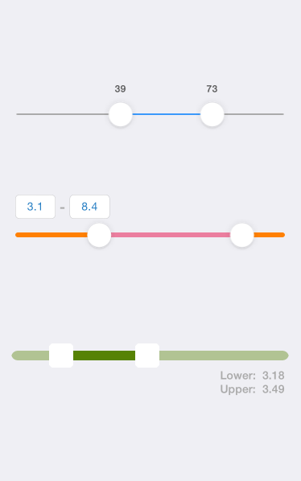

# CCRangeSlider
CCRangeSlider is a customisable iOS slider with 2 handles for defining a value range.

Sample Screenshot:



## Usage

### Adding CCRangeSlider
* Copy CCRangeSlider folder to your project.
* Add CCRangeSlider instance to your view (OR in Interface Builder, set an UIView's Custom Class to CCRangeSlider).

### CCRangeSlider Logic Wire-Up

* Register event listener :
```Objective-c
[rangeSlider addTarget:self
                action:@selector(updateSliderLabel:)
      forControlEvents:UIControlEventValueChanged];
```

* And handle event :
```Objective-c
- (void) updateSliderLabel:(CCRangeSlider*)rangeSlider
{
    CGFloat lowerValue = rangeSlider.lowerValue, upperValue = rangeSlider.upperValue;
}
```


### Customising CCRangeSlider

* Specify slider min/max range:
```Objective-c
rangeSlider.minValue = 0.0;
rangeSlider.maxValue = 10.0;
```

* Specify slider lower & upper values:
```Objective-c
rangeSlider.lowerValue = 3.2;
rangeSlider.upperValue = 8.7;
```

* Specify slider step size:
```Objective-c
rangeSlider.stepSize = 0.1;
```

* Slider track customisations
```Objective-c
// Set slider track color
rangeSlider.trackColor = [UIColor orangeColor];

// Set color for highlighted section of the slider track
rangeSlider.trackHighlightColor = [UIColor colorWithRed:235/255.0 green:126/255.0 blue:159/255.0 alpha:1.0];

// Set height of slider track
rangeSlider.trackHeight = 6.0;

// Pass in images for slider track rather than just simple colors
rangeSlider.trackImage = [UIImage imagedNamed:@"track-image"];
rangeSlider.trackHighlightImage = [UIImage imagedNamed:@"track-image-highlight"];
```

* Slider handle customisations
```Objective-c
UIImage *handleImage = [UIImage imageNamed:@"handle-image"];
[rangeSlider setHandleImage:handleImage withSize:handleImage.size];
```

## Authors
##### Hsuan-Chih Chuang

## License
##### Licensed under the MIT License.
